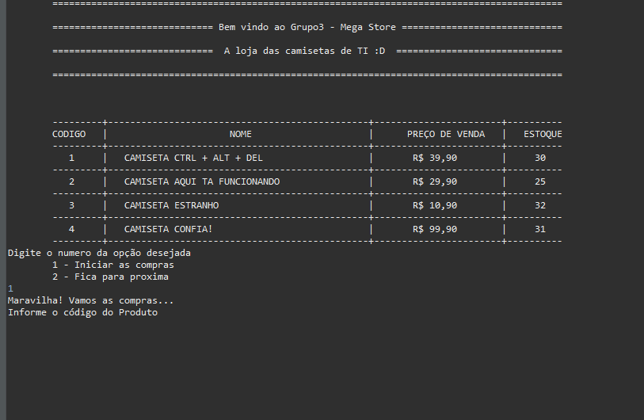

# Desafio do Programador -PanAcademy

Faremos uma Loja virtual com Carrinho de Compras!!!  :shopping_cart:

Em resumo vamos buscar produtos por código, adicionar quantidades dos itens selecionados, somar os preços de diversos itens que queremos comprar e adicionar desconto dependendo da forma do pagamento.

Vídeo demonstração>  https://vimeo.com/638599204

# Requisitos:

- A nossa loja deve conter estoque;
- Caso produto esteja indisponível deve retornar a mensagem para o cliente “Produto Indisponível”;
- Deverá ter 3 formas de pagamento: 
- À vista (dinheiro ou pix) tem 20% de desconto;
- À vista no crédito tem 10% de desconto;
- Parcelado em até 3x não tem desconto;
- Deve retornar a nota fiscal com o valor pago de tributos de 9% sobre a compra(Esse valor não deve ser somado ao total do carrinho, somente ser exibido na nota fiscal);
- O PROGRAMA TEM QUE RODAR NO CONSOLE.

## Atividade realizada em grupo

A atividade foi realizada em grupo. 
Meu grupo foi composto de 4 pessoas.
- Dorian Vieira
- Pedro Henrique
- Vitor Pirovani Paixão
- Jader Greiner

## Desenvolvimento da atividade
Nos encontramos on-line durante os horários de aula. Optamos em cada DEV desenvolver seu código e trocamos conhecimento experiências e conhecimentos. Compartilhamos código e sugestões entre os integrantes.

Ao final do projeto, cada integrante apresentou uma solução diferente para o mesmo problema, o que foi muito interessante.

# Soft Skills desenvolvidas
- Criatividade
- Gestão de tempo
- Trabalho em equipe
- Colaboração
- Comunicação
- Persuação

# Sobre o meu projeto

Meu projeto possui 4 classes (Product, Carrinho, Item, Principal)

* Product
	* Classe que armazena os atributos dos produtos de nossa loja, com metodo construtor e Geters and Seters (encapsulamento)

* Item
	* Classe que constroi os itens do carrinho de compras. Basicamente qual o produto e sua quantidade

- Carrinho
	 *	Inicia as compras, armazena os itens e possui os métodos de fechamento  e pagamento da compra. 

* Principal
	* A classe de chamada do programa e também a que possui o maior fluxo de interações com o usuário. 

## Lições aprendidas
* A importância de um bom planejamento;
* O trabalho colaborativo;
* Praticar o desenvolvimento de códigos
	
