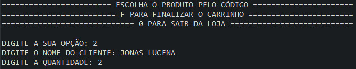
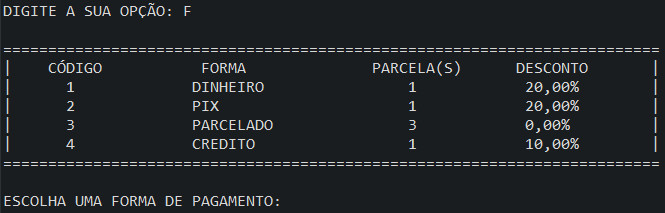

# Pan Store - Desafio 1 - Turma 1

## Desenvolvedores

<table>
  <tr>
    <td align="center"><a href="https://github.com/carlosbetiol"> <b>Carlos Betiol</b></a> </td>
    <td align="center"><a href="https://github.com/jonaslucenafilho"> <b>Jonas Lucena</b></a> </td>
    <td align="center"><a href="https://github.com/hellomp"> <b>Marcos Paulo</b></a> </td>
    <td align="center"><a href="https://github.com/WCL79"> <b>Weslley Lima</b></a> </td>
  </tr>
  <tr>
    <td align="center"><a href="https://github.com/zecarlos558"> <b>José Carlos</b></a> </td>
    <td align="center"><a href="https://github.com/tiagodalmeida87"> <b>Tiago Almeida</b></a> </td>
    <td align="center"></td>
    <td align="center"></td>
  </tr>
</table>

## Tutores

- Jenifer Plácido
- Ana Verônica
- Jonathan Ferreira

> Status do Projeto: Concluido :heavy_check_mark:

## Tópicos

* [Escopo e objetivo](#Escopo-e-objetivo)
* [Diagrama de Classes](#Diagrama-de-Classes)
* [Gerência do Projeto](#Gerência-do-Projeto)
* [Screenshots](#Screenshots)
* [Patrocinadores](#Patrocinadores)

## Escopo e objetivo

Desenvolver um programa para simular um carrinho de compras sendo as telas demonstradas em modo texto na console segundo os requisitos descritos no documento do desafio [Desafio do programador](19_10_Desafio_do_programador.pdf).

## Diagrama de Classes

Para facilitar a divisão de tarefas entre os membros do time e representar de forma visual a arquitetura utilizada, segue o diagrama de classes abaixo.

A classe database representa o depósito de dados e as demais são entidades.

As classes PagamentoDinheiro, PagamentoPix, PagamentoCartaoCredito e PagamentoCartaoVista são classes filhas da classe abstrata FormaPagamento, evidenciando o uso de polimorfismo dentro de Database.

Houve a tentativa de encapsulamento dos membros das classes assim como a divisão de responsabilidades visando um baixo acoplamento e alto grau de manutenibilidade. 

## Gerência do Projeto

O time é multidisciplinar auto gerenciável e não foi necessário um PO ou gerente de projeto.

Para gerenciamento do projeto foi utilizado o Trello sendo aplicado um quadro KANBAN onde cada desenvolvedor arrasta um card para realizar a tarefa. 

Abaixo um screenshot ilustrativo feito durante o desenvolvimento do projeto

## Screnshots

## Patrocinadores

# 
