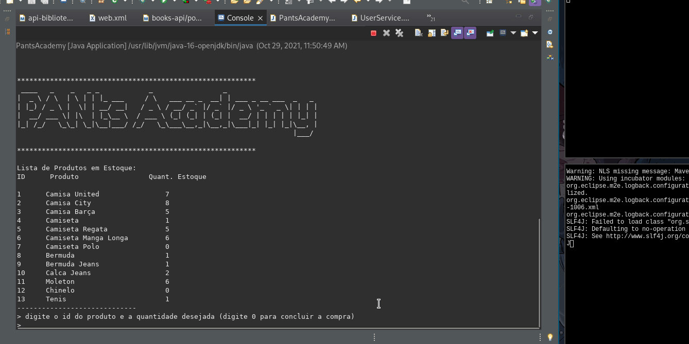

Desafio 1 - Bootcamp banco PAN + Gama Academy
=

A challenge that consists in creating a simple shopping program in java that runs on a terminal.

## About this repository

This repository was made collaboratively by the following members, [Felipe Cândido](https://github.com/felipecandidoo), [Rodrigo Medeiros](https://github.com/MedeirosRodrigo), [Jonas William](https://github.com/JonasWilliam), [Carmo Júnior](https://github.com/CarmoPJunior) and me, [Ícaro Pablo](https://www.github.com/IcaroPablo).

We tried to apply basic java concepts in this little project, such as `variables`, `conditionals`, `loops` and `object orientation`. We also chose git along with github to practice a consistent workflow for teams in programming projects.

As this project was not so complex, we decided not to come with any sofisticated approach. At first we established the most important `classes` that would be built and their most important `methods` and `attributes`, after that we decided which member would work on which class, this would prevent our code of having too many conflicts to solve. At last we kept communicating with each other to be aware of the values given and taken by each method and thus keep a solid correct code when implementing classes and instantiating `objects`. You can see our result below :)

>_Must say that my team was awesome_

## Preview

<!--  -->


## Usage

#### If you don't have `JDK` installed yet you can download it in the following sources
- [Oracle's website](https://www.oracle.com/java/technologies/downloads/)
- [OpenJDK's website](https://openjdk.java.net/)
- [SDKMAN tool](https://sdkman.io/)

>_I'm not gonna guide you through the full process of installation, the internet has plenty of resources for that_

#### If you already have `JDK` installed:

- Download this repository
```console
$ git clone https://github.com/IcaroPablo/Desafio1.git
```
- Import it on your favorite IDE (mine was `Eclipse`)
- Open main class of the project (PantsAcademy.class in the `main` package)
- Run the project from there
- Your JVM should do the rest ;)

>_Important note: the program is written in portuguese_

## How to contribute

1. Fork the repository clicking [here](https://github.com/IcaroPablo/Desafio1/fork)
2. Create a branch for your feature (just for the sake of good practice, but you can just modify your main branch)
```console
$ git checkout -b my-new-feature-branch
```
3. Commit your changes
```console
$ git commit -am 'Add some feature'
```
4. Push to the remote repo
```console
$ git push origin my-new-feature-branch
```
5. Create a new Pull Request in github to my repository

## Author

Hello! I'm [Icaro Pablo](https://www.github.com/IcaroPablo), this whole repository is part of my personal portfolio, so, I'd be happy if you could provide me any feedback about the project's code, structure or anything that could make me a better developer. You can contact me through the links bellow :)

<p>
<a href="https://www.linkedin.com/in/%C3%ADcaro-andrade-9543bb163/" target="_blank">  </a>
<a href="mailto:ic4ro.p4blo@gmail.com" target="_blank">  </a>
</p>

## License

This project is licensed under the MIT License, see the [LICENSE](https://github.com/IcaroPablo/Desafio1/blob/master/LICENSE) file for details.

## Special Thanks

Gama academy and PAN bank, for all these interesting classes and for guiding all the students along several weeks of coding.
